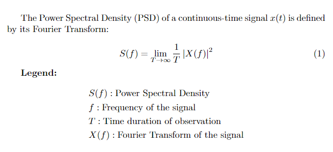

# an intro to brain computer interfaces

*Published 07.15.2025*

One summer break in 5th grade, I vividly remember being terrified to go to the doctor; not only for the taste of medicine, but because I was worried the doctor would listen to my heartbeat and find out that I liked a girl from my school.

Technology and my understanding of doctors have come a far way since then, but still mind-reading feels more of a sci-fi enthusiast pipe dream rather than a developing technology on the horizon. But seeing research labs and companies enable people with neurodegenerative diseases or paralysis to control prosthetics, and even play videogames with their mind, makes this pipe-dream seem not too far away.

## brain computer interfaces

Brain-Computer interfaces or bci's are what enable this kind of technological breakthrough.

*Credit: CNBI Lab, The University of Texas at Austin*

BCI's are the technology that convert brain signals into actions on a computer or machine, but Electroencephalograms [ EEGs ] are the machines that give us these readable brain signals. Simply put, an EEG is a collection of metal electrodes that are put on a person's scalp in a specific arrangement [most commonly, the 10-20 system], by reading the differences in potential between these electrodes [and a ground], we get a varying electrical signal from each electrode.

While EEGs have been around nearly a century, I was interested in how actions in the brain could be understood by looking at these signals. To do this, I decided to complete a **motor imagery identification task**: a common bci task that determines whether the subject is *imagining* to move the left vs right hand.

## motor cortex

Luckily, neuroscience has given us a good understanding of where in the brain these *imaginary movements* occur. The motor cortex, is a part of the cerebral cortex that control voluntary actions in the brain.

In the 10-20 system, the electrodes **C3, Cz and C4** are positioned near the motor cortex, and *should* tell us the most about the imaginary movement that the subject is performing.

Furthemore, medical knowledge shows that within the motor cortex, there are different parts [ the specifics here aren't terribly important, and they are way above me ] that correspond to controlling various parts of our body. This has been mapped by Wilder Penfield and his co-investigators and compiled into the **Cortical homunculus**

A rather disturbing image, this model shows us that left vs right hand movement are on opposite sides of the motor cortex, which should make them easier to differentiate, especially since electrodes C3 and C4 are positioned on opposite sides of the head in this area.

*Side Note:* This diagram also shows that the regions controlling both feet are closer together, making differentiating them more difficult.

## the data

The data I used for this project came from the [BCI Competition IV 1 dataset](https://www.bbci.de/competition/iv/desc_1.html).

I encourage everyone to read the problem statement for this problem; it proposes a challenge of classifying motor imagery **without time cues**. However, since I am just introducing myself to bci's, I chose to save this problem for after this project [ I have some notes ideas about this problem in the conclusion section of this article ]

The data is provided in a matlab file (.mat), and I did this analysis using python [ though i **really** should switch to matlab, a shift I am making right after writing this hopefully ]

The data was provided as an array of samples of each of 59 EEG electrodes/channels, sampled at 100Hz over a period of time. During this time, the subject was given cues to move their left or right hand, the time of each cue and its classification has been provided in the data.

For the BCI framework, I chose a system [ that I thoroguhly explain throughout this article ] based on examples from online, best practices, and algorithms I have used in other ml projects. The code for the CSP function come from the Python EEG toolbox: [Boris Reuderink's EEG Tools](https://github.com/breuderink/eegtools)

Since we are performing **cued motor imagery classification**, we only care about the time immediately after the cue is provided. I chose a trial length of 2 seconds, starting 0.5 seconds after cue onset. The data collected has several test subjects [ and some artificially generated datasets ], I only used one test subject in my analysis.

## power spectral density

Currently, if we plotted our EEG data, it would look something like this:

This, clearly is too abstract for any model to easily fit. Since it is a fluctuating continuous output of a single variable over time, we would want to perform something like a Fast Fourier Transform to get the independent sine-wave frequencies that make-up this signal. An extended version of this approach - Power Spectral Density (PSD) - is used in this BCI method.

PSD takes the square of the truncated Fourier transform of the signal and divides by time, this yields a value in units of **Watts/Hz**, which is Power (in the physics sense) distributed over frequencies: Hence Power Spectral Density.

*note: following the ideas in the math make sense here, but I am still looking into PSD for the motivation behind this formula.*

In our context, "*power*" is analagous to neural activity [ or technically any electric activity ], giving us the density of neural activity at different frequencies from every channel. Below are the PSDs for the C3 Cz and C4 channels.

## bandpass filtering

The brain has various neural oscillations, better known as brain waves: these wave can be grouped roughly according to their function.

- **Delta (δ)** [0.5-4 Hz] - Deep sleep, unconsciousness, healing
- **Theta (θ)** [4-8 Hz] - Drowsiness, light sleep, deep meditation, creativity
- **Alpha (α)** [8-13 Hz] - Relaxed wakefullness, calm focus, closed eyes
- **Beta (β)** [13-30 Hz] - Alertness, problem solving, active thinking, stress
- **Gamma (γ)** [30-100+ Hz] - High-level cognition, attention, memory, consciousness integration

We should expect most of the difference to come from the alpha band [ as previous research has shown ], but just to be explicit, below are the generated PSD plots for various bands in the C3 Cz, and C4 channels

## common spatial pattern

This BCI method uses log-variance for it's variance measure, a fairly standard function in machine learning, so I won't delve into it here.

Currently, our alpha band log-var looks as such:

As we can see, there are slight deviations, and potentially we can train an ml algorithm from here, but we could just be overfitting the data, some of these differences look negligible. To improve our features, lets take a step back and ask ourselves what these channels are.

Each of these channels is an electrode placed on the scalp with even-ish spacing according to the 10-20 system. While this is great for trained neuroscientists to understand the EEG data, our ideal model should focus only on a handful of features that best differentiate the classifications.

The Common Spatial Pattern [ CSP ] algorithm is a widely praised algorithm that is invaluable in modern BCI research. CSP uses spatial filters to extract features from a signal that maximize discriminability of two classes.

*note:* CSP is a very interesting algorithm that I plan to implement from the ground-up in the near future, but the specifics are beyond the scope of this project.

The code for the CSP algorithm that I used here came from the Python EEG tools mentioned in the data section. The CSP algorithm provides a mixing matrix of size channels * channels. Once this mixing matrix is applied, the channels are in increasing order of varaince [ note here that since channels can have negative variance, when we compute the log-variance, we will get all positive numbers, meaning that the log-variances will go from high, to low, to high ]. Below is the log-variance plot for the alpha band after applying CSP.

As we can see, the first and final elements have an *incredibly* large variance between the 2 classes. This is really incredible, CSP has provided us a set of new channels, made as combinations of our standard 59 channels, and in these new channels, we have some that are incredibly discriminant of the left vs right hand motor imagery.

Below are the PSD plots of the first, middle, and last features from the CSP matrix, we can see here that not only is there a significant difference in the classes, there are features in the data that are activated *more* for left and right hand movements.

Again, we should emphasize how **interpretable** these results are. Each CSP feature is vector of all of the standard 59 channels, if we only take the first and last CSP features, we have effectively found regions of scalp that have maximal discriminability. To visualize this, the topographic mappings of the first and last CSP features are below:

*note: when I was generating these images, I thought something had gone horribly wrong, since these areas of the brain didn't line up with where the motor cortex was. I sifted through some of the lower variance features, and eventually found some that looked roughly in the area of the motor cortex, but by repeating this analysis across all of the subjects in the dataset, I found **these exact locations** as the first and last component every time. This probably means that there is a connection between these locations and motor imagery.*

We can see here, that the locations that these 2 features locate on the brain are presumably near the parts of the motor cortex that control arm movement. This means, we could reduce our 59 channels to just these 2 new channels if we needed to.

## classification

Since this task has turned out to have 2 features with very high discriminability of the classification problem, we can use "*Linear Discriminant Analysis*" to determine the hyperplane that best divides this data. However in 2 Dimensions, a hyperplane is just a line, so this becomes a very simple linear classifier, a fairly simple LDA model is used to determine the weight and bias.

LDA is a common method used in BCI. It scales as so: CSP will always provide the most discriminant features in the channels, we can then choose a certain number of feature we would like to train our LDA model on, obviously the usual machine learning problems such as overfitting apply here too.

For the linear classifier, I used an 80:20 split of training and testing data. The scatterplot below shows the classifier with the training points.

The scatterplot with testing data and the confusion matrix are displayed below:

**Accuracy: 92.5%**

## conclusions

Classification of intention from EEG data is a crucial task to implement faster, more efficient, and more accurate Brain Computer Interfaces. Future exploration topics that I am interested in include:

1. implementing CSP (working on this next)

2. uncued classification

3. personalized models, calibration challenges/efficiency

4. training subjects to provide more consistent signals

### a note on interpretability

The most exciting part of this project for me was the interpretability of its results, once I saw the CSP matrix, I thought of what this finding meant in this context. I was easy to see that it represented a brain region, and by using some visualization, I found brain regions that have a strong impact on motor imagery, that I wouldn't ever have known about before.

Simply put, any result is only as useful as it is interpretable, this goes for all of machine learning [ and pretty much everything else ]. I am sure there are more complex algorithms used in BCI research, and if we use modern ml techniques on BCI, we could esily find ourselves in situations similar to financial models, we would have *block boxes* as algorithms, unable to interpret their meaning. This is an issue across the board in ML and I believe that algorithmic interpretability is the most important aspect of most algorithms. So I will look at future research that I can do on interpretability in this space

### uncued classification

Some closing thoughts about the uncued classification problem:

- Train a model that can detect the cue by training on the first 0.5 seconds of signal onset

- Compare the values during motor imagery and rest for the most discriminant features

*References*

BCI Competition IV. (n.d.). Data set 1: Description. BBCI. https://www.bbci.de/competition/iv/desc_1.html

CNBI Lab. (n.d.). Brain-Computer Interface System Diagram [Photograph]. The University of Texas at Austin.

Nicolas-Alonso LF, Gomez-Gil J. Brain computer interfaces, a review. Sensors (Basel). 2012;12(2):1211-79. doi: 10.3390/s120201211. Epub 2012 Jan 31. PMID: 22438708; PMCID: PMC3304110

Penfield, W., & Rasmussen, T. (1950). The cerebral cortex of man: A clinical study of localization of function. Macmillan.

Reuderink, B. (n.d.). eegtools: Python toolbox for EEG signal processing [GitHub repository]. https://github.com/breuderink/eegtools