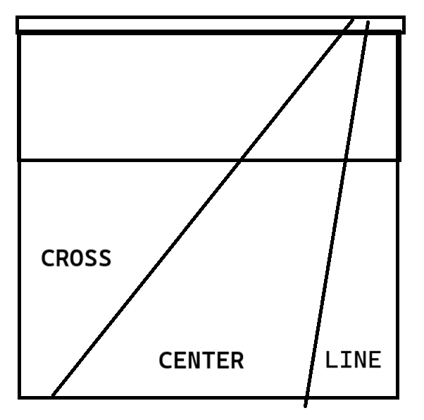

# bump, set, spike: volleyball strategy
*Published 06.24.2025*

Volleyball is usually associated with crazy verticals, tall blocks and powerful spikes; a sport incredibly inacessible to short people. As an **average height** male myself, I never took a huge liking to volleyball until recently at ut orientation, when I discovered that I have an uncanny ability to keep the volleyball off the ground.

Since then, I have become a libero; a defensive specialist in volleyball. With this position comes a bit of strategic leadership in the backrow, and it got me thinking about volleyball strategy. So here is a short description of the findings from my venture down this rabbit hole

## Positions

A quick overview to those uninitiated, volleyball is a team sport where up to 12 players are on the court at once, 6 per team. There are 5 roles on a volleyball court:

1. **Setter** - coordinate the offense of the team, they usually take second touch to setup one of the hitters

2. **Outside Hitter** - star hitters of the team, hit from the left side of the net, occasionally a second setter

3. **Opposite Hitter** - primary blocker against opposing outside hitter, alternate option for hitting

4. **Middle Blocker** - makes the double block along with the hitter on the side the ball is coming from, third option for hitting

5. **Libero** - coordinate the defense of the team, only play on the backrow, usually takes first touch and serve recieve

While that may be a bit confusing to look at, playing through a rally better explains the roles. The progression of a rally looks like this:

**Team A:** Serve

**Team B:** Serve Recieve -> Set -> Hit

**Team A:** Block -> Save -> Set -> Hit

**Team B:** Block -> Save -> Set -> Hit

This cycle of play is called *in system*, since it is the most common. With the rotations and serve recieve rules, the specifics of where the players are in each team strategy is incredibly complex and quite boring, so we will just look at base positions [the positions that player move to after the serve recieve and throughout the rest of the rally]

Positions are grouped into vertical pairs - (1,2) (3,6) (4,5). And players are paired such that both of them will be in one of those 2 positions throughout all of the rotations

- (1,2) - Setter + Opposite Hitter

    The setter will be in position 1 and the oppposite hitter wil be in position 2 for 5/6 rotations and they will swap for one rotation

- (3,6) - Middle Blocker + Libero
    
    There will be 2 middle blockers on the team that will cycle between these positions, but whenever one of them needs to be in the backrow, they will get subbed out for a libero. The libero will always be in position 6. Middle blocker will always be in position 3

- (4,5) - Outside Hitter + Outside Hitter

    The star player of the team will occupy more of position 4, and whichever outside hitter is in position 5 will serve as the primary backrow hitting threat

But strategy in this system can be split into 2 parts: offensive strategy and defensive strategy. Let's take a look at those

## Offensive Strategy

Usually coordinated by the setter, offensive strategy is about the second and third touches of the ball on your own side of the court. Since your team has possession during this period, offensive strategy revolves around decieving your opponents and mental gameplay.

### The set

Most first touches will [and should] go to your team's libero, as the best passer on the team, the libero shoud reliably pass the ball a few feet short of the net between areas 2 & 3. Once your setter determines that the libero [or outside hitter] is recieving the ball, the setter will move up towards the net, between the 2 & 3 positions, ready to set the pass. once the setter is in position, all of the 4 hitters on the team will step back and start their run up for the spike.

### Spike Options

The options ranked by frequency are as so:

1. **Outside Hitter** - star hitter of the team, setter is usually right handed, so they face the left side and can more easily set towards the left-sided outside hitter, however the opposing primary blocker is a opposite hitter, who is very experienced in blocking

2. **Opposite Hitter** - alternate option hitter, requires a backset for right-handed setters, however the opposing primary blocker is an outside hitter, less experienced in blocking

3. **Backrow Outside Hitter** - hitting from the backrow it is harder to get the ball down short of the opponent defense, but the timing on the hit will be slower, if sold well, the opposing blocker may have already jumped and landed by the time that the backrow hitter spikes the ball

4. **Middle Blocker** - hits from the middle blocker are very quick, the ball is spiked as soon as its out of the setters hand, these short sets can be deadly, but need to be timed and faked well since you are spiking into the tallest member of the other team - their middle blocker

The type of spike that these hitters choose to perform can vary, but we will cover that in the defensive section

### Edge Cases

Though the libero will try to take most of the recieving load, there may be situations where the setter has to take first touch. Some of these scenarios will quickly devolve into *out of system* mayhem to keep the ball alive, but if coordinated well, the setter will pass to the spot closer to the net between positions 3 & 4. Then the backrow outside hitter will set the ball with the same options as the setter had.

If the setter fails to get the recieved ball to the frontrow, the libero will also sometimes set or bump-set the ball towards one of the corner hitters.

## Defensive Strategy

Defensive strategy is coordinated by the Liberos and involves moving your block and recievers based on the opponents hit and your players' strengths and weaknesses. Since each rally can go any way, defense is all about adapting in the moment and communication. Still, it is effective to have protocols for the most common types of hits from the opposing team: outside hits.

When the other team's outside hitter is hitting the ball, they have 3 directions to hit in

A double block can move to cover roughly one of these 3 hitting directions, and which one to choose really comes down to the strengths of the team's backrow. The setter will always be in position 1, meaning that when the other team's outside hits, the setter will always be in the line region

When the double block covers one of the regions, the backrow player in that region will cover the "*seam*" of the block [the case when the ball goes through the block]

### Tips

Before we delve into the differnt backrow positions to cover hard spikes, lets also mention tips; fake hits where the opponent hitter simple tips the ball over the block, causing it to land short, right behind the block. This area is problematic since the backrow is positioned further back in the court to deal with fast spikes.

The tip is usually covered by the 3rd front row player, in this case: the front row Outside Hitter. However, since not all outside hitters are the greatest at diving and saving well positioned balls, the libero often dives in to save these balls [these moments are some of the only times liberos get recognition -_-]

### Blocking the center

Covering the center seems the most logical, it is the easiest place for the hitter to put the ball down hard, and it shortens the distance that the middle blocker has to run to join the double block. This leaves 2 harder recieving positions and 1 seam position. Which is usually covered as so:

- **Cross - Libero:** Largest unblocked region to cover, requires faster reaction time and diving

- **Center - Outside Hitter:** Since there is already a block here, the OH just has to cover the seam, which is generally the slowest balls

- **Line - Setter:** This is also quite a hard lane to cover, requires the setter to be good at recieving, also means that the setter will be unable to get second touch on the ball, requiring the OH to set the ball

Due to the swap in Libero and OH, and requiring the setter to force themselves out of the setting position, this strategy should be used when your OH is weak in recieving but strong in setting.

### Blocking the Line

In the case when your 2nd setter (one of the Outside Hitters) is worse at setting and/or your setter is worse at recieving, you will want to block the line. This puts a lot of pressure on the cross, since it is entirely unblocked, you almost certainly want your libero to cover it. The OH will have to cover the center, which could be dangerous if they aren't a good reciever, but this leaves your setter in a prime position to start a good attack.

### Opposite Hitting

When the opposite hitter on the other team hits the ball, your less experienced in blocking, Outside Hitter will have to block a less experienced in hitting, Opposite Hitter. This dynamic can shift from player to player, but quite generally, it is much harder to vary shots from the opposite side of the net with power.

When blocking an opposite hitter, the block should cover the center, which can be remedied with the same backrow setup as before:

- **Position 5 (Line) - Libero:** From the same position as before, the Libero now covers the line and part of the seam from the less experienced frontrow Outside Hitter

- **Position 6 (Center) - Outside Hitter:** Since there is already a block here, the OH just has to cover the seam, which is generally the slowest balls

- **Position 1 (Cross) - Setter:** With right-handed opposite hitters and right-handed setters, it is hard for a good cross ball to come over since the setter has to backet the ball into the perfect spot, and the opposite hitter needs to either reveal that he is going cross by starting his run up outside of the court, or generate a lot of torque through his body in the air. This body rotation will cause the hit to be less hard, which make it ok for the setter to recieve [*note tat these effects by handedness are a big reason why left-handed OPs and left-handed setters are a big advantage*]

### Triple Block

When a certain hitter is giving the block or the backrow a lot of trouble, you can run a triple block, where all 3 frontrow players become part of the block. Since this formation is only used against very good hitters, your block should cover all of the line and center.

This leaves your **libero at position 5** to cover the hard cross and any tips. Which does mean the libero will need to play shorter on the court, and dive more often.

## Leadership and Strategy

Through these examples, we can see that volleyball takes lots of adaptation and modifications to drilled strategies to be played well. While the coach can help in timeouts and from the sideline between points, this strategic leadership falls on the libero and the setter for the defensive and offensive ideas respectively.

This vocal leadership role and trust that the team builds around each other are key reasons to why I think at higher levels of volleyball, the libero should play more of position 5.

While at the low level, when the blocks are worse and the hits are less fast, the libero in position 6 is best: this allows them to dive for short balls, cover teammates in the backrow, and receive more of the service.

But at a higher level, position 5 seems more demanding of a defensive specialist. It allows the libero to play more towards the front row, where they can cover tips and recover balls that the other team blocks. This also places the libero in the hardest recieving position regardless of which hitter is hitting from the outside.

## Conclusions

This is far too much thinking for the level of volleyball I am playing. But I always find it interesting to study the strategy behind sports I am interested in. I did the same for american football and circket, but luckily I'm pretty decent as a libero in volleyball, so maybe, just maybe, this knowledge will help some day.
